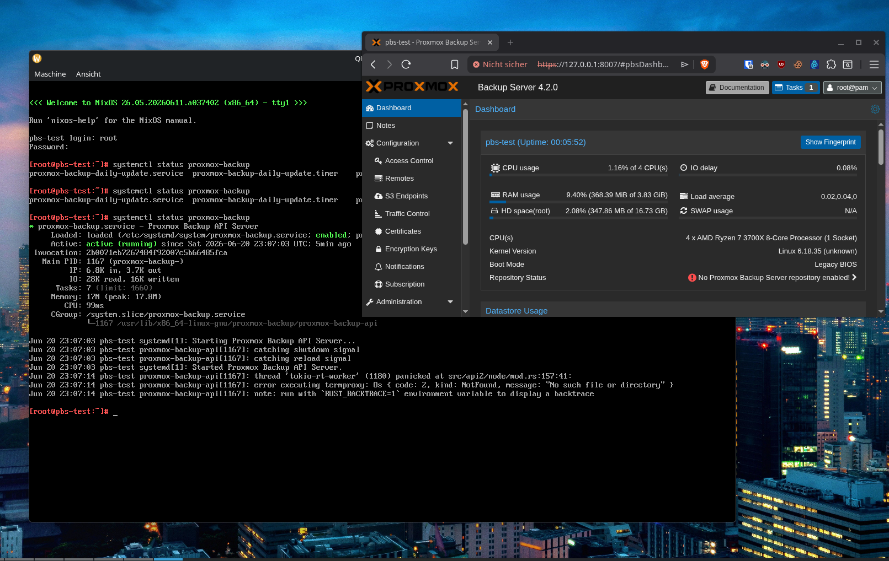

# Proxmox Backup Server for NixOS (experimental)



A native Nix package and NixOS module for [Proxmox Backup Server](https://pbs.proxmox.com/)
(PBS). No Debian container, no `dpkg` runtime, just a regular Nix derivation and a
systemd-based service.

The package builds **PBS 4.2.2** from the upstream Proxmox git sources, reusing the same
source set and Cargo lock basis as the nixpkgs `proxmox-backup-client` package. The web UI
assets are pulled from the official Proxmox `.deb` archives and stitched together at build
time.

> [!IMPORTANT]
> **Feedback wanted.** This port works for me, but it needs more eyes. I'm filing a
> [tracking issue per untested feature](../../issues). If you run PBS on NixOS with this,
> please try them out and report back (👍/👎, logs, edge cases) on the relevant issue, or
> open a new one. Real-world reports are the fastest way to move this from "experimental" to
> "trusted."

> [!WARNING]
> This is an **experimental, unofficial** port. It is **not** supported by Proxmox Server
> Solutions GmbH. Do not contact Proxmox support for issues with this packaging. The web UI
> carries a banner saying as much. See [Status & limitations](#status--limitations) before
> relying on it for anything you care about.

## Todo
- [ ] NixOS VM based Tests
- [ ] Real World Testing
- [ ] Gather Feedback
- [ ] Upstream to Nixpkgs

## What you get

- `pkgs.proxmox-backup-server`: the base build (binaries `proxmox-backup-api`,
  `proxmox-backup-proxy`, `proxmox-backup-manager`, `proxmox-tape`, `pmt`, `pmtx`, the
  debug/migration helpers, the bundled web UI, and shell completions). See
  [How it works](#how-it-works) for why this isn't run directly.
- `pkgs.proxmox-backup-server-fhs`: the runnable package, the base wrapped in an FHS
  environment. This is what the module and the CLIs use.
- `services.proxmox-backup-server`: a NixOS module that creates the `proxmox-backup-server` user/group,
  the runtime/state/cache/log directory tree, PAM auth integration, and the `proxmox-backup`
  / `proxmox-backup-proxy` systemd units plus the daily-update timer.

## Requirements

- Nix with [flakes](https://nixos.wiki/wiki/Flakes) enabled.
- A `x86_64-linux` or `aarch64-linux` host. The bundled web UI `.deb` assets are
  `amd64`/`all`, and PBS itself is Linux-only.

## Binary cache

Prebuilt packages are pushed to Cachix from GitHub Actions. To use the cache, add this to
your Nix configuration:

```nix
{
  nix.settings = {
    substituters = [ "https://awildleon-nixos-pbs.cachix.org" ];
    trusted-public-keys = [
      "awildleon-nixos-pbs.cachix.org-1:4kEEBSONGJ0F7Ita/3ZRcTWaR6M7YHXhltJaoEYl3ew="
    ];
  };
}
```

Or for a single command:

```sh
nix build .#proxmox-backup-server-fhs \
  --extra-substituters https://awildleon-nixos-pbs.cachix.org \
  --extra-trusted-public-keys awildleon-nixos-pbs.cachix.org-1:4kEEBSONGJ0F7Ita/3ZRcTWaR6M7YHXhltJaoEYl3ew=
```

## Build

```sh
nix build .#proxmox-backup-server-fhs   # runnable, FHS-wrapped
nix build .#proxmox-backup-server       # base build only
```

The `-fhs` result contains the FHS-wrapped CLI launchers under `bin/` and the daemon launchers
under `libexec/proxmox-backup/`. The base result holds the raw binaries and assets in a normal
Nix layout (`bin/`, `lib/<multiarch>/proxmox-backup/`, `share/`).

## Try it in a VM

The flake ships a throwaway `pbs-test-vm` NixOS configuration so you can poke at a running
instance without touching your host.

Build and run it:

```sh
./scripts/run-vm.sh
```

This builds the VM and launches it with all runtime state pinned to `./.vm-state/`
(gitignored), so the system disk and the secondary datastore disk (`/dev/vdb`, a
blank 20 GiB image) persist across reboots. Delete `.vm-state/` to start fresh.

> Running the generated `run-pbs-test-vm` script directly also works, but it stores
> the secondary disk in a throwaway `/tmp/nix-vm.*` dir that is recreated blank on
> every boot — use `scripts/run-vm.sh` if you want the disk to stick around.
>
> For an auto-rebuilding clean-slate dev loop, use `./scripts/dev-loop.sh`.

Then access:

| Service       | Address                                      |
| ------------- | -------------------------------------------- |
| PBS web / API | <https://localhost:8007/> (self-signed cert) |
| SSH           | `ssh -p 2222 root@localhost`                 |

The VM's root password is `nixos`. Log in to the web UI with user `root@pam` and that same
password.

## Use it on a real host

### With flakes

Add the flake as an input and import the module:

```nix
{
  inputs.pbs.url = "github:AWildLeon/nixos-pbs"; # or path:/... for local work

  outputs = { self, nixpkgs, pbs, ... }: {
    nixosConfigurations.host = nixpkgs.lib.nixosSystem {
      system = "x86_64-linux";
      modules = [
        pbs.nixosModules.proxmox-backup-server
        ({ pkgs, ... }: {
          nixpkgs.overlays = [ pbs.overlays.default ];

          services.proxmox-backup-server = {
            enable = true;
            openFirewall = true;
          };
        })
      ];
    };
  };
}
```

### Without flakes

The repo ships a `default.nix` / `shell.nix` that re-export the same outputs via
[NixOS/flake-compat](https://github.com/NixOS/flake-compat), so you don't need flakes
enabled. Pin the repo with `fetchTarball` (or a channel / `niv` / a vendored checkout) and
use the `overlays.default` and `nixosModules.proxmox-backup-server` attributes in your
`configuration.nix`:

```nix
{ pkgs, ... }:
let
  pbs = import (fetchTarball {
    url = "https://github.com/AWildLeon/nixos-pbs/archive/main.tar.gz";
    # sha256 = lib.fakeSha256; # pin this for reproducibility
  });
in
{
  imports = [ pbs.nixosModules.proxmox-backup-server ];

  nixpkgs.overlays = [ pbs.overlays.default ];

  services.proxmox-backup-server = {
    enable = true;
    openFirewall = true;
  };
}
```

To just build the package without flakes: `nix-build` (produces `./result`).

After a rebuild, set things up from the CLI (the web login uses PAM, so `root@pam` with the
host's root password works too):

```sh
proxmox-backup-manager user list
# then create a datastore, e.g. (or do it via the UI)
proxmox-backup-manager datastore create main /var/lib/proxmox-backup/datastores/main
```

### Module options

| Option                                        | Type    | Default                          | Description                                 |
| --------------------------------------------- | ------- | -------------------------------- | ------------------------------------------- |
| `services.proxmox-backup-server.enable`       | bool    | `false`                          | Enable the Proxmox Backup Server service.   |
| `services.proxmox-backup-server.package`      | package | `pkgs.proxmox-backup-server-fhs` | The PBS package to use.                     |
| `services.proxmox-backup-server.openFirewall` | bool    | `false`                          | Open TCP port `8007` for the web/API proxy. |

## How it works

PBS is built as a normal `rustPlatform.buildRustPackage` derivation from the upstream git
repos (`proxmox-backup`, `proxmox`, `proxmox-fuse`, `pxar`, `pathpatterns`), with a small
cargo patch to re-route dependencies that aren't on crates.io. The web UI is assembled in
`postPatch`/`postInstall`: the official `.deb` assets are unpacked, the ExtJS bundle is
concatenated from the upstream `Makefile`'s file list, and UI features that don't apply to a
NixOS host (xterm.js shell, APT updates/repositories, disk/ZFS management, network/time
config, reboot/shutdown buttons) are trimmed out.

PBS hardcodes Debian-style FHS paths at runtime (`/usr/share/javascript/proxmox-backup`,
`/usr/lib/<multiarch>/proxmox-backup`, `/usr/bin/ip`, ...), so packaging is split in two, the
way nixpkgs handles FHS-assuming software (compare `steam` / `steam-run`):

- **`proxmox-backup-server`** is the base build. It lays the binaries and web assets out in a
  normal Nix layout (`$out/{bin,lib,share}`); it is not run directly.
- **`proxmox-backup-server-fhs`** wraps each binary in a [`buildFHSEnv`](https://nixos.org/manual/nixpkgs/stable/#sec-fhs-environments).
  `buildFHSEnv` maps the base package's `$out/{bin,lib,share}` onto `/usr`, giving PBS the
  paths it expects, bind-mounts `/run` and `/var` from the host, and provides a private `/etc`
  that already links the host's `passwd`/`group`/`shadow`/`pam.d`/`ssl` (so PAM and TLS work);
  the writable config dir `/etc/proxmox-backup` is bound in on top.

The systemd units and the CLIs on `$PATH` all come from `proxmox-backup-server-fhs`, so the
NixOS module carries no bind-mount plumbing of its own.

## Repository layout

```
flake.nix                              # packages, overlay, NixOS module, test VM
default.nix / shell.nix                # non-flake entry points (via flake-compat)
overlay.nix                            # nixpkgs overlay, shared by both entry points
modules/proxmox-backup-server.nix      # the services.proxmox-backup-server module
pkgs/proxmox-backup-server/
  package.nix                          # base build (orchestration only)
  sources.nix                          # pinned upstream git + .deb sources
  www/                                 # web UI replacement files + transform scripts
  Cargo.lock                           # pinned Rust dependency lock
  0001-cargo-re-route-...patch         # cargo source re-routing patch
pkgs/proxmox-backup-server-fhs/
  package.nix                          # buildFHSEnv wrapper around the base build
```

## Status & limitations

The package builds and the core services run, but the following still need testing or are
known to be incomplete. Each has a [tracking issue](../../issues). Please add your results
there:

- Runtime service behavior under real backup/restore/sync/GC workloads.
- Generated docs and manpages.
- PAM / authentication integration beyond basic `root@pam` login.
- Privileged tape helper setup (`pmt`, `pmtx`, `sg-tape-cmd`).
- Assumptions that only hold on Debian-style systems.

Contributions and bug reports are welcome.

## License

The packaging in this repository (the Nix expressions, module, and docs) is licensed under
the **MIT** license. See [`LICENSE`](LICENSE).

Note that the software it builds, **Proxmox Backup Server, remains licensed under the
AGPL-3.0-only** by its authors; the MIT license here does not relicense it. Proxmox® is a
registered trademark of Proxmox Server Solutions GmbH. This is an independent, unofficial
packaging effort and is not affiliated with or endorsed by Proxmox.

> [!NOTE]
> Phrasing borrowed from nixpkgs: the MIT license does not apply to the packages built by
> this repo, merely to the files in this repository (the Nix expressions, build scripts,
> NixOS module, etc.). It also might not apply to patches included here, which may be
> derivative works of the packages to which they apply. Those artifacts are covered by the
> licenses of the respective packages.

## End Goal

The end goal of this project is to get a stable Proxmox Backup Server (with module)
upstreamed into [NixOS/nixpkgs](https://github.com/NixOS/nixpkgs).

## Notes
Large parts of this were written with Claude Code. I've reviewed everything, corrected where needed, and understand every line of it. That said: there may be dragons.